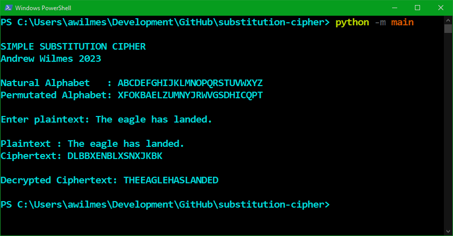
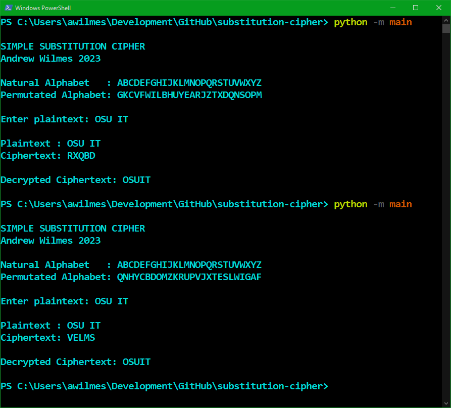

# substitution-cipher
A simple Substitution Cipher built using Python.

# Description

This program takes plaintext input from the user, converts it to ciphertext, and displays it to the user. The program then decrypts the ciphertext using the same key, and displays the final result.

Note: The program will remove whitespace, special characters, and numbers from the plaintext input.

## Key Generation

Each key is generated by selecting random letters from the alphabet, and appending them to an empty array. The program prevents duplicates from occuring in the key, and will always produce a key length of 26.

# Screenshots

Example output:

Output demonstrating how a new key is randomly generated each time:
